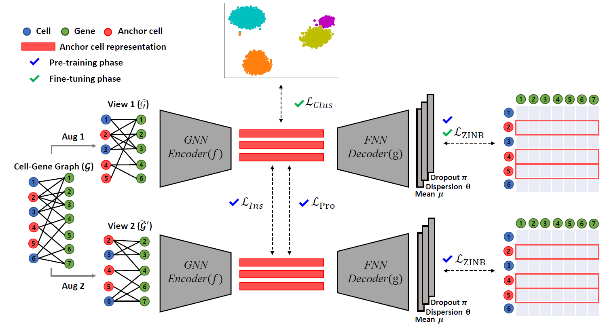

# Deep single-cell RNA-seq data clustering with graph prototypical contrastive learning

<p align="center">
  
  <a href="https://pytorch.org/" alt="PyTorch">
    </a>
    
The official source code for "Deep single-cell RNA-seq data clustering with graph prototypical contrastive learning".

## Overview

Single-cell RNA sequencing (scRNA-seq) enables researchers to study cellular heterogeneity by measuring transcriptome-wide gene expression at single cell level. To this
end, identifying subgroups of cells with clustering techniques becomes an important task for downstream analysis. However, challenges on the scRNA-seq data such as  pervasive dropout phenomena and high dimensionality hinder obtaining robust clustering outputs. Although many existing works are proposed to alleviate these problems, we
argue that they fall short of fully leveraging the relational information inherent in the data, and most of them only adopt reconstruction-based losses that highly depend on the quality of features. In this paper, we propose a graph-based prototypical contrastive learning method, named scGPCL. Specifically, given a cell-gene bipartite graph that captures the natural relationship inherent in the scRNA-seq data, scGPCL encodes the cell representations based on Graph Neural Networks (GNNs), and utilizes prototypical contrastive learning scheme to learn cell representations by pushing apart semantically disimillar pairs and pulling together similar ones. Through extensive experiments on both simulated and real scRNA-seq data, we demonstrate that scGPCL not only obtains robust cell clustering outputs, but also handles the large-scale scRNA-seq data.

</img>

## Requirements
- Python version : 3.9.7
- Pytorch version : 1.10.1
- torch-geometric version : 2.0.3
- scanpy : 1.8.2

## Download and pre-processing data (Real single-cell RNA-seq data)
Create the directory to save the raw and preprocessed data.
```
mkdir raw_data
```
Download and save the data to raw_data directory from following references.
- [Mouse Embryonic Stem cells (Mouse ES cells)](https://www.ncbi.nlm.nih.gov/geo/query/acc.cgi?acc=GSE65525)
- [Mouse bladder cells](https://figshare.com/s/865e694ad06d5857db4b)
- [Zeisel](https://www.ncbi.nlm.nih.gov/geo/query/acc.cgi?acc=GSE60361) / [Subgroups](http://linnarssonlab.org/cortex/)
- [Worm neuron cells](https://atlas.gs.washington.edu/worm-rna/docs/)
- [10X PBMC](https://support.10xgenomics.com/single-cell-gene-expression/datasets/2.1.0/pbmc4k)
- [Human kidney cells](https://github.com/xuebaliang/scziDesk/tree/master/dataset/Young)
- [Shekhar mouse retinca cells](https://www.ncbi.nlm.nih.gov/geo/query/acc.cgi?acc=GSE81904)

Follow the preprocessing.ipynb to prepare the input data.


## How to simulate
To demonstrate the effectiveness of our model, we conduct experiments on the challenging simulated datasets.  
All of the simulated datasets are generated by using Splatter Package and you can follow our simulation settings from simulate.ipynb

## How to Run

```
git clone https://github.com/Junseok0207/scGPCL.git
cd scGPCL
```

- Case 1: Evaluation under Dropout Phenomena  

```
sh scripts/Dropout.sh
```

- Case 2: Evaluation under Low Signal  

```
sh scripts/Sigma.sh
```

- Case 3: Evaluation under Imbalanced Subgroups of Cells  

```
sh scripts/Imb.sh
```

- Real single-cell RNA-seq datasets  

```
sh scripts/Real.sh
```

- Or you can reproduce our experiment result with reproduce.ipynb file.

## Hyperparameters

`--name:`
Name of the dataset.  
usage example :`--dataset Zeisel`

`--recon:`
Type of reconstruction loss.  
usage example :`--recon zinb`

`--n_clusers:`
Number of Clusters.   
usage example :`--n_clusers 4`

`--HVG:`
threshold for variance filtering.   
usage example :`--HVG 0.2`

`--lr:`
Learning rate to train scGPCL.  
usage example :`--lr 0.001`

`--tau:`
Temperature for contrastive loss.  
usage example :`--tau 0.25`

`--r:`
Theshold to terminate pre-training phase.  
usage example :`--thres 0.8`

`--tol:`
tolerance for delta clustering labels to terminate fine-tuning phase.  
usage example :`--thres 0.8`

`--lam1:`
Weight for Node-wise Consistency Regularization loss  
usage example :`--lam 0.5`

`--lam2:`
Weight for Label-guided Consistency Regularization loss  
usage example :`--lam2 0.5`

`--lam3:`
Weight for Label-guided Consistency Regularization loss  
usage example :`--lam3 0.5`

Using above hyper-parmeters, you can run our model with following codes  

```
python main.py --recon zinb --name Zeisel --n_clusers 9 --lr 0.0001 --tau 0.25 --r 0.99 --tol 0.0001 --lam1 1.0 --lam2 0.05 --lam3 1.0
```


